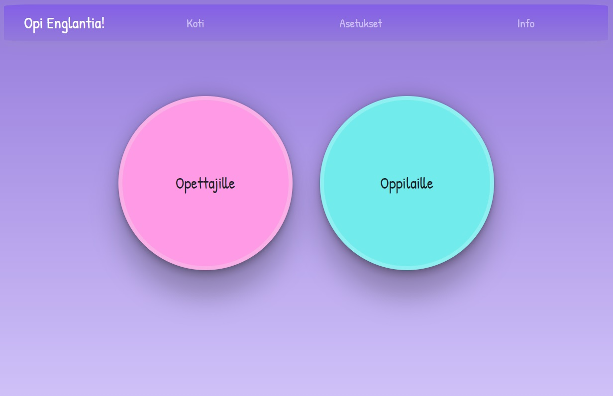

# Language app for learning english words (for finnish kids)

This application is designed for finnish kids and teachers to support learning english.
Deployed in heroku: https://fin-eng-translation-app.herokuapp.com/

This is a fullstack project that uses React.js in the frontend and Node.js with Express.js library
in the backend. It was a lot of work but definitely a learning experience.
Backend is connected to MySQL database on our school (TAMK) server and it fetches data from there.
Front code is done with modern function based React that uses hooks.

The application has 2 modes, for students and for teachers.

Students can pick a category they wish to practice words from and start training.

Students are then presented with multi-choice questions and they have to choose
the correct translation for the word in question.

In teacher mode the teacher can add new words with translation and a tag to the external database
which creates new learning material.

